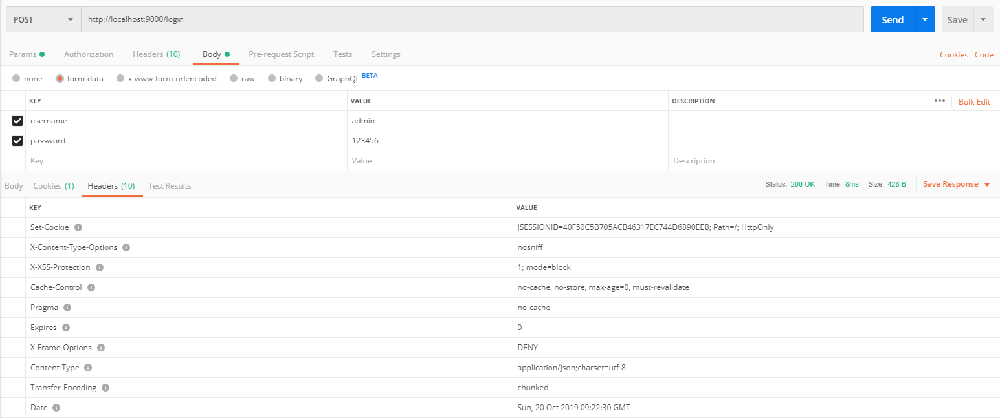
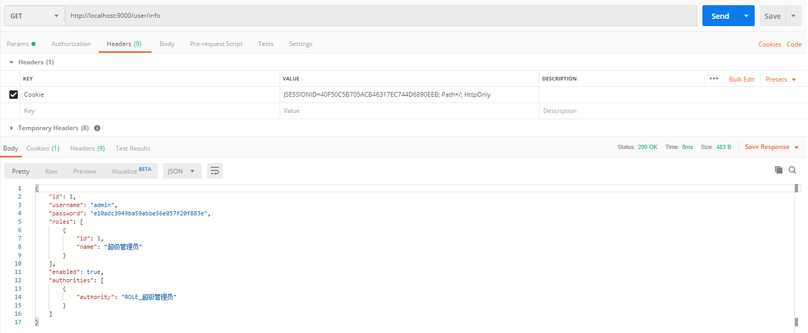
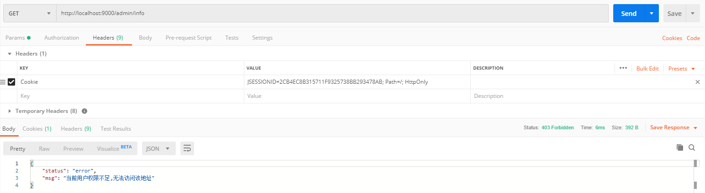
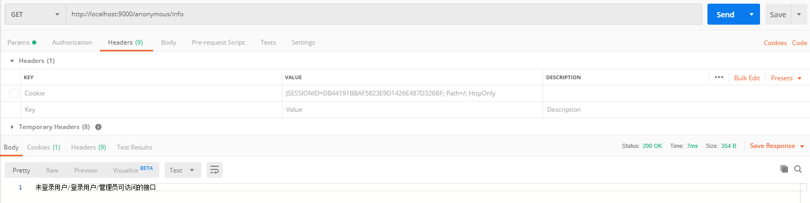
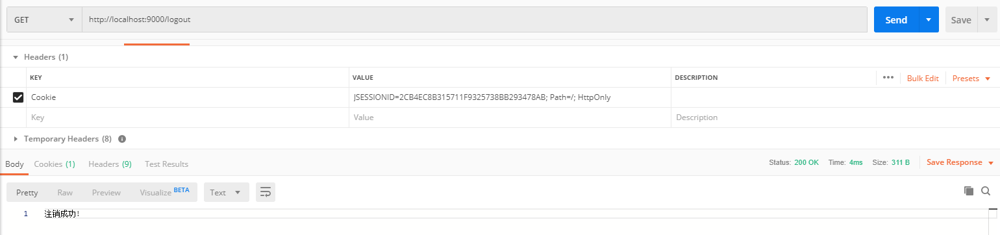

# spring-boot-login-demo
基于Spring Security登录、注销、权限控制的示例项目
# 简介
- 项目编写于：2019年10月20日
- 依赖版本
    - spring-boot-starter:2.2.0.RELEASE
    - spring-boot-starter-web:2.2.0.RELEASE
    - spring-boot-starter-security:2.2.0.RELEASE
    - lombok:1.18.10
# 登录

# 访问接口

# 无权限

# 未登录

# 注销

